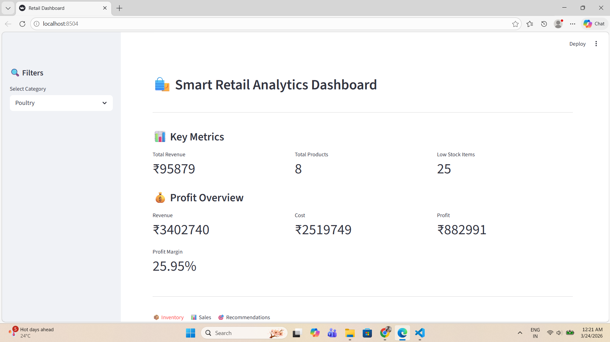
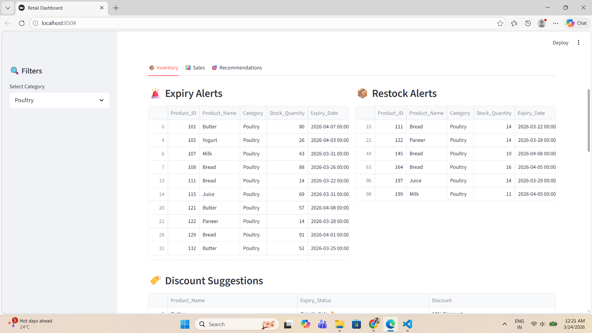
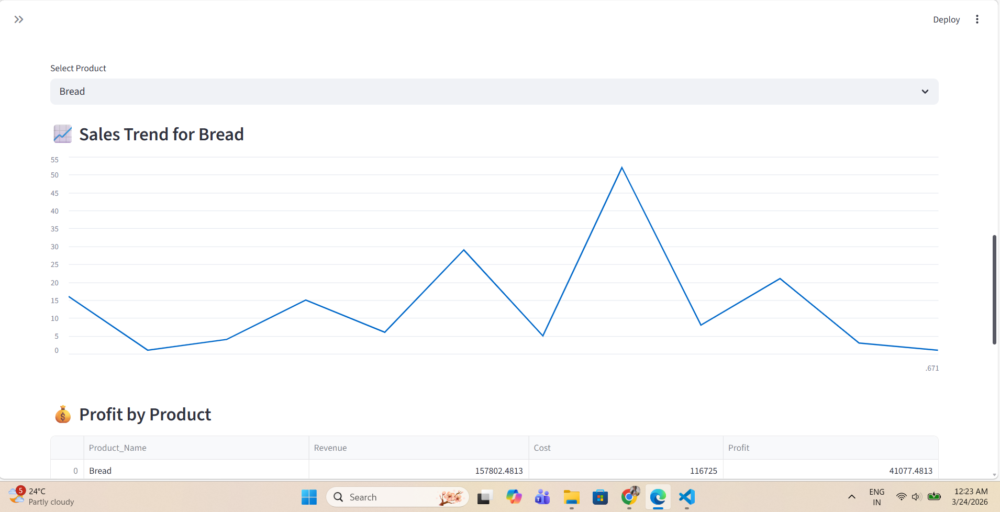
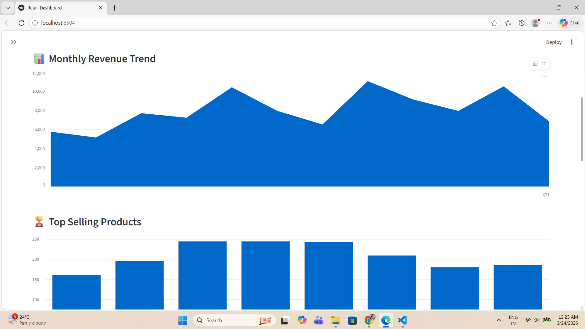
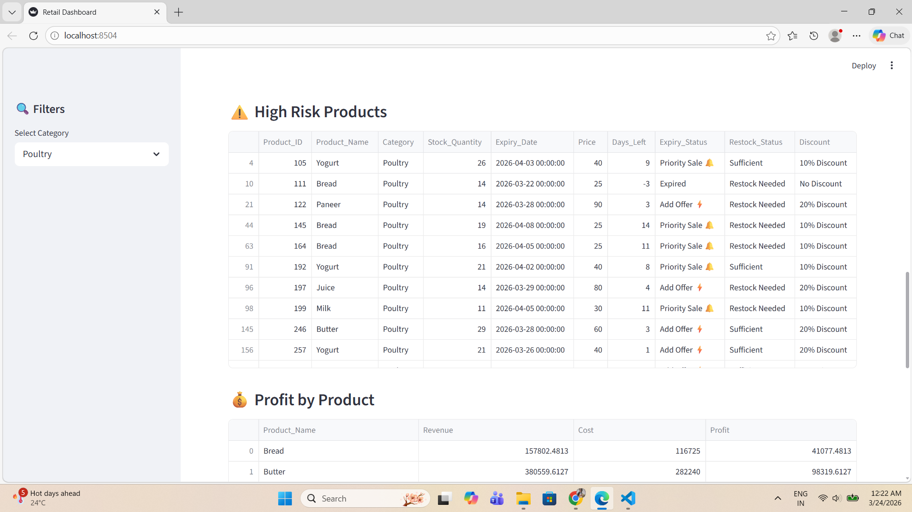
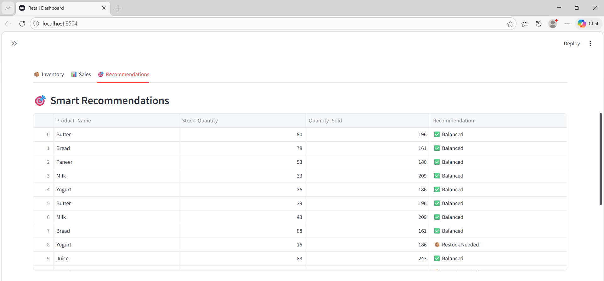
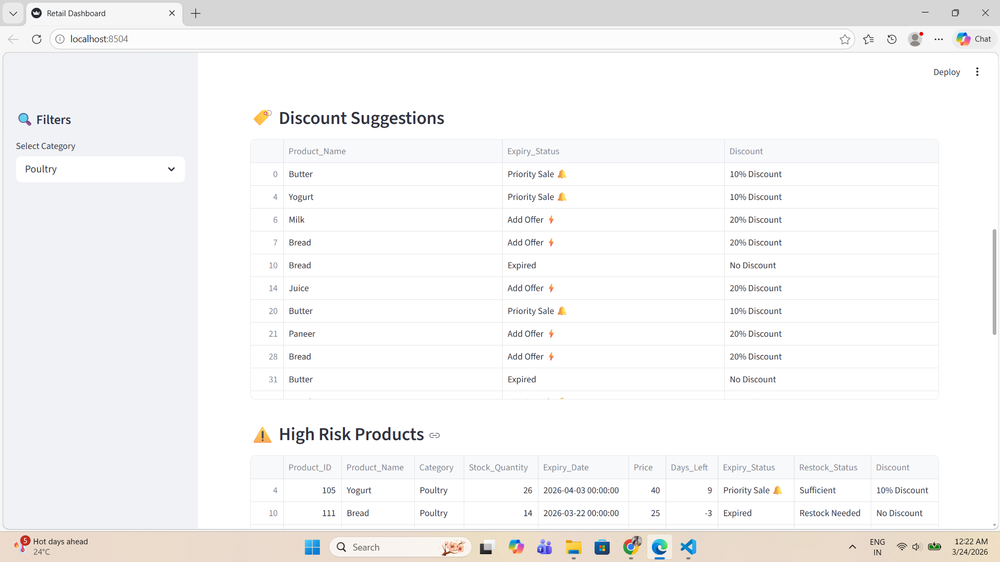

# 🛍️ Smart Retail Analytics Dashboard

🚀 Live Streamlit Dashboard (Run locally using instructions below)

## 📌 Overview

This project is an end-to-end retail analytics system designed to help businesses manage inventory, analyze sales performance, and make data-driven decisions.

It combines **inventory monitoring**, **sales analytics**, and **business recommendations** into a single interactive dashboard.

---

## 🚀 Key Features

### 📦 Inventory Management

* ⏳ Expiry alerts with early warning (20 days before expiry)
* ⚡ Discount recommendations for near-expiry products
* 📦 Restock alerts for low inventory

### 📊 Sales Analysis

* 📈 Monthly revenue trends
* 🏆 Top-selling products
* 📉 Product-wise sales insights

### 💰 Profit Analysis

* Realistic profit calculation using dynamic margins
* Profit comparison across products

### 🎯 Recommendation System

* Suggests products to restock or reduce
* Identifies high-demand and low-performing items

### 📈 Interactive Dashboard

* Built using Streamlit
* KPI metrics, filters, and charts
* Downloadable reports

---

## 📸 Dashboard Preview

<p align="center">
  
  
</p>
<p align="center">
  
  
</p>

<p align="center">
  
  
  
</p>

---

## 🛠 Tech Stack

* Python
* Pandas
* Streamlit
* Matplotlib

---

## 📂 Project Structure

```
Retail-Analytics-Dashboard/
│
├── app.py
├── generate_inventory.py
├── generate_sales.py
├── inventory_analysis.py
├── sales_analysis.py
├── recommendation_system.py
│
├── inventory_data.csv
├── sales_data.csv
│
├── images/
│   ├── dashboard_overview.png
│   ├── inventory_alerts.png
│   ├── sales_analysis.png
│   ├── discounts_on_about_to_expire_items.png
│   ├── recommendations.png
│   └── monthly_revenue.png
│   └── expiry_alerts.png
├── requirements.txt
└── README.md
```

---

## ▶️ How to Run the Project

1. Clone the repository:

```
git clone https://github.com/your-username/your-repo-name.git
cd your-repo-name
```

2. Install dependencies:

```
pip install -r requirements.txt
```

3. Run the dashboard:

```
streamlit run app.py
```

---

## 💡 Business Impact

This system helps businesses:

* Reduce losses from expired products
* Optimize inventory levels
* Improve sales strategies
* Make data-driven decisions

---

## 🙋‍♀️ About Me

I built this project to apply data analytics concepts to real-world business problems and strengthen my skills in Python, data analysis, and dashboard development.

---

## 🔗 Connect with Me

* LinkedIn: https://www.linkedin.com/in/gudla-akanksha-data-analyst
* GitHub: https://github.com/gudlaakanksha011
* Email: gudlaakanksha011@gmail.com

---

⭐ If you found this project useful, feel free to star the repository!
